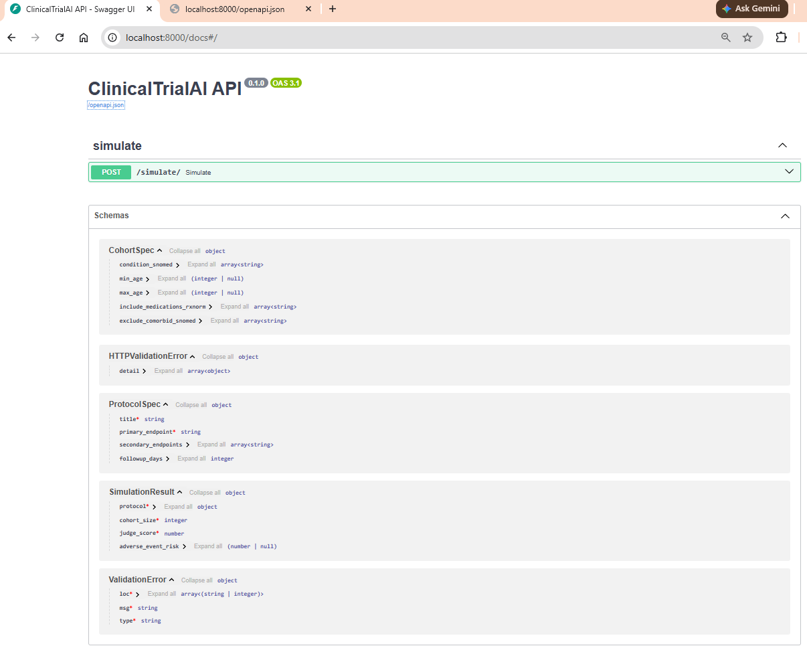

# ClinicalTrialAI — Simulate and Emulate Clinical Trials (Phase‑1)

ClinicalTrialAI is an industry‑ready, IRB‑aligned platform to simulate and emulate clinical trials using real EHRs (via FHIR), a clinical knowledge graph, multi‑agent orchestration, and multi‑modal LLMs — with safety, auditability, and ontological grounding baked in.

This repository currently targets a Phase‑1 vertical slice for rapid iteration on design: synthetic FHIR → de‑id → OMOP → Neo4j → multi‑agent simulation → IRB‑ready export, with strict PHI guardrails and an append‑only audit ledger.

---

## Key Guarantees (Phase‑1)
- PHI never enters an LLM context window; prompts are sanitized and checked by tests.
- Every action is auditable (append‑only ledger).
- Agent communications use typed contracts (Pydantic) instead of free‑form chat.

See `docs/PLAN.md` and `docs/DESIGN.md` for full rationale and architecture.

---

## Repository Layout
- `docs/` — plans, design, compliance notes (see `docs/IMPLEMENTATION_PLAN.md`).
- `src/` — application code organized by bounded context.
  - `src/api/app.py` — FastAPI app; mounts `/simulate`.
  - `src/agents/` — cohort, protocol, adversary, judge, and orchestrators.
  - `src/graph/` — schema, queries, Neo4j driver, RAG retriever (pgvector stub).
  - `src/ingestion/` — FHIR client, de‑identification, OMOP ETL, Airflow DAGs.
  - `src/security/` — audit ledger and RBAC policy stubs.
  - `src/llm/` — prompt sanitation and providers (placeholders).
  - `src/observability/tracing.py` — OpenTelemetry bootstrap (console exporter).
- `scripts/` — CLI utilities (`setup_graph.py`, `load_omop.py`, `run_simulation.py`, `export_report.py`).
- `tests/` — unit, integration, and security (PHI leakage, audit ledger) tests.
- `infrastructure/helm/clinicaltrial-ai/` — Helm chart (API Deployment/Service, init Job).

---

## Prerequisites
- Python 3.11+
- Poetry (for dependency management)
- Optional: Neo4j 5.x (local or managed); set `NEO4J_*` in `.env`
- Optional: Docker + Kubernetes + Helm (for cluster deployment)
- Optional: Airflow 2.7+ (to run the ingestion DAG locally or in a scheduler)

---

## Quick Start (Local Dev)

1) Install dependencies
- Ensure Python 3.11+ and Poetry are installed.
- From repo root, run: `poetry install`

2) Configure environment
- Copy `.env.example` to `.env` and adjust as needed.
  - Orchestrator/tracing toggles: `USE_LANGGRAPH=true`, `OTEL_ENABLE=true`.
  - Neo4j (optional): `NEO4J_URI`, `NEO4J_USER`, `NEO4J_PASSWORD`.
  - SMART‑on‑FHIR (optional): `USE_SMART_FHIR`, `FHIR_ENDPOINT`, `FHIR_CLIENT_ID`, `FHIR_CLIENT_SECRET`, `FHIR_TOKEN_URL`.

3) (Optional) Start Neo4j and seed minimal data
- Start Neo4j locally or point to a managed instance.
- Apply graph schema constraints: `python scripts/setup_graph.py`
- Load synthetic patients: `python scripts/load_omop.py`

4) Run the API
- Start server: `uvicorn src.api.app:app --reload`
- Test health (browser): `http://localhost:8000/docs`

5) Call the simulation endpoint
- Example request:
  ```
  curl -X POST http://localhost:8000/simulate/ \
       -H "Content-Type: application/json" \
       -d '{"condition_snomed":["44054006"],"min_age":60,"max_age":80}'
  ```
- Example response (stubbed, depends on data):
  ```
  {"protocol":{...},"cohort_size":123,"judge_score":0.75}
  ```

6) Run the CLI vertical slice (prints Cypher and writes audit log)
- `python scripts/run_simulation.py`
- Audit entries append to `.audit_ledger.log`.



7) Run tests
- `pytest -q`
- Format/lint: `black src tests` and `ruff .`

---

## Airflow Ingestion DAG (Optional)
- File: `src/ingestion/pipelines/ingest_dag.py`
- Behavior:
  - If `USE_SMART_FHIR=true` and FHIR env vars are set, pulls real FHIR bundles via `src/ingestion/fhir/client.py`.
  - Otherwise uses `tests/fixtures/sample_fhir_bundle.json`.
  - Chain: fetch_fhir → deidentify → transform_omop → graph_load.
- To use:
  - Ensure Airflow 2.7+ is installed and the repo is on the scheduler’s PYTHONPATH.
  - Set required env vars in the Airflow environment.
  - Trigger `ingest_fhir_to_graph` from the Airflow UI or CLI.

---

## Helm Deployment (Dev)

This chart deploys the API and an init Job that seeds the graph.

1) Prereqs
- A container image that contains this repo code and dependencies.
- A Kubernetes Secret with the Neo4j password: `neo4j-auth` (key: `password`).

2) Important values (see `infrastructure/helm/clinicaltrial-ai/values.yaml`)
- `image.repository` / `image.tag`
- `env.NEO4J_URI`, `env.NEO4J_USER`, `env.neo4jSecretName`
- `api.port` and `api.service.port`

3) Install
- From chart directory: `helm install clinicaltrial-ai ./infrastructure/helm/clinicaltrial-ai`
- The pre‑install Job runs: `python scripts/setup_graph.py && python scripts/load_omop.py`.

4) Access
- Port‑forward the service or expose via an Ingress; default service is ClusterIP on port 80.

---

## Configuration Reference
- `.env.example` — local dev env vars (copy to `.env`).
- Orchestrator selection: `USE_LANGGRAPH=true` uses the LangGraph orchestrator (`src/agents/orchestrator/graph.py`); otherwise falls back to the sequential runner (`src/agents/orchestrator/runner.py`).
- Tracing: `OTEL_ENABLE=true` enables a console exporter (`src/observability/tracing.py`).

---

## Security & Compliance (Phase‑1)
- PHI Guardrails: `src/llm/prompt_engineering/templates.py` implements prompt sanitization; `tests/security/test_phi_leakage.py` enforces no PHI in prompts.
- Auditability: `src/security/audit_ledger/ledger.py` provides an append‑only ledger; `tests/security/test_audit_ledger.py` verifies behavior.
- RBAC placeholder: `src/security/rbac/policies.py` (wire to real auth provider in later phases).

---

## Roadmap (Next)
- Replace cohort size estimation with live graph queries across full OMOP mappings.
- Expand LangGraph with typed transitions, retries, and error edges.
- Add full OMOP table coverage and pgvector‑backed retriever.
- Add CI (unit/integration/security), Dockerfile, and GitHub Actions for build/push.
- Harden Helm chart with NetworkPolicies, Secrets management, and HPA.

---

## Troubleshooting
- Neo4j connection errors: verify `NEO4J_URI/USER/PASSWORD`; try `python scripts/setup_graph.py`.
- 403 on `/simulate`: RBAC is permissive by default, but verify dependency injection in `src/security/rbac/policies.py`.
- PHI test failing: inspect sanitization regex in `src/llm/prompt_engineering/templates.py` and fixtures in `tests/fixtures/`.
